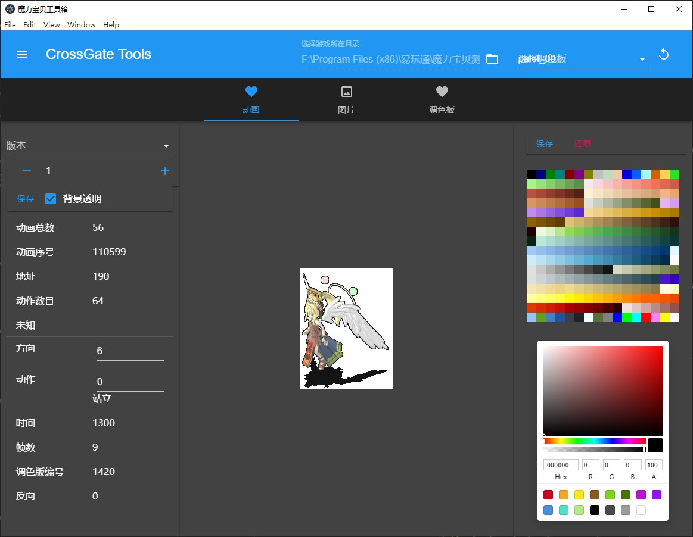

# CrossGate Tools
一个魔力宝贝的工具箱。

采用 electorn react-redux typescript material jimp等实现




# 特性

- [x]  图片预览，读取二进制文件，解析文件，图像数据进行Run-Length解密，canvas渲染
- [x]  图片保存
- [x]  调色版选择
- [x]  自定义色版
- [ ]  动画预览
- [ ]  地图预览
- [ ]  调用c++引入一些图像dll


# 开发
```
npm run start
```

# 打包
```
npm run build
```


# 故障

## 1.运行时提示

> Electron failed to install correctly, please delete node_modules/electron and try installing again


```
# 设置系统环境变量
ELECTRON_MIRROR="https://cdn.npm.taobao.org/dist/electron/"
```
```
rm -rf node_modules/electron
cnpm install --verbose electron
```

## 2.开发模式下会提示

> 'electron' 不是内部或外部命令，也不是可运行的程序 
每次重新install的时候会都会有这个提示，需要重新操作一次。
```
rm -rf node_modules/electron
cnpm install --verbose electron
```


